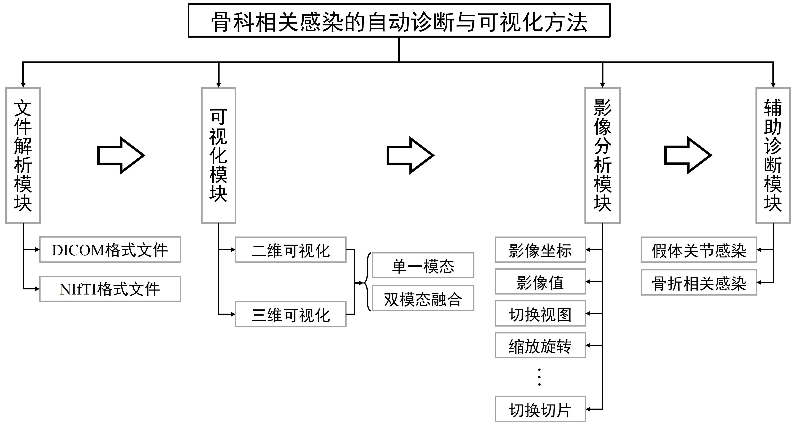
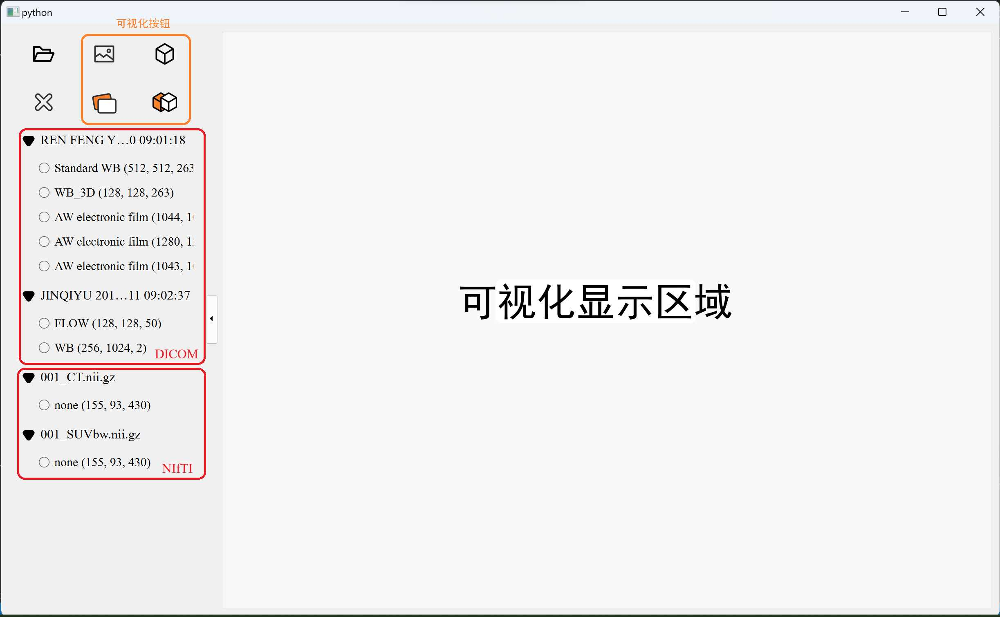
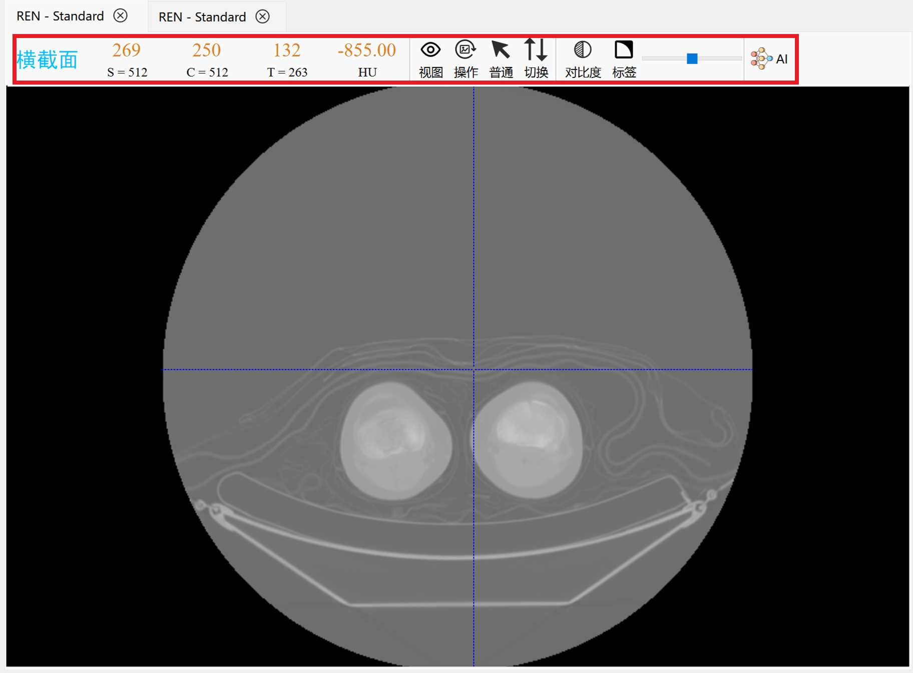
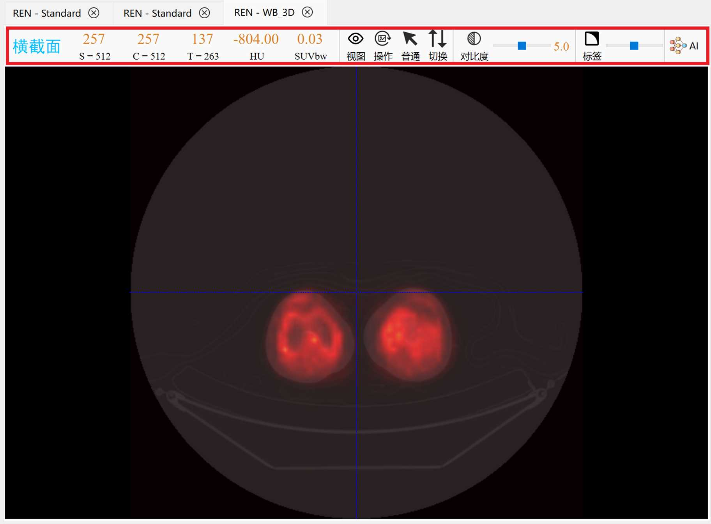
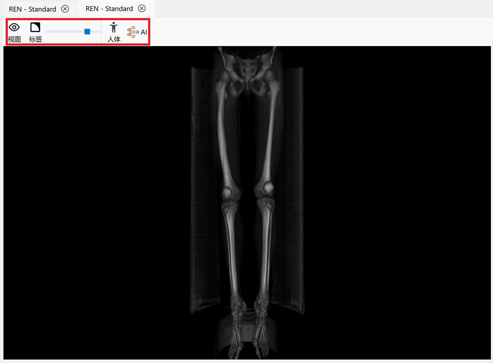
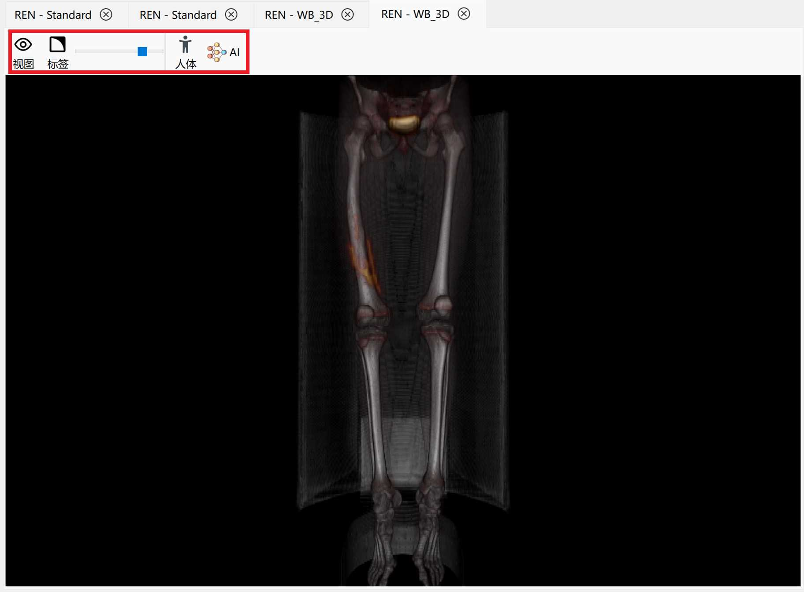

# 骨科相关感染的自动诊断与可视化方法

该方法结合两种人工智能方法并采用最新的PyQt6框架，旨在构建一个骨科相关感染的自动辅助诊断全流程，提供全面的医学影像可视化、阅览和分析功能，以促进临床诊断中假体关节感染与骨折相关感染的诊断决策和提高准确性。

## 整体设计

该方法流程涵盖了四个关键模块和相应的工作流程。整个方法流程由四个主要步骤构成：
1. 文件解析：被用户选定的DICOM或NIfTI文件经过读取和解析，其中根据各自的文件规范执行相应的解码流程，旨在准确抽取所需的医学信息数据。
2. 可视化：经过解析得到的数据在预处理后转化为视觉表现形式，以直观展示医学影像。该预处理包括标准化、配准和融合，以提供丰富且细致的视觉信息。
3. 影像分析：在实现影像数据的视觉呈现后，影像分析步骤提供了一系列工具，用于在多个视角和尺度下观察医学影像，包括视图切换、仿射变换等等操作。
4. 辅助诊断：在用户通过可视化和影像分析获得初步印象后，辅助诊断步骤通过假体关节感染辅助诊断框架和骨折相关感染自动检测诊断框架，为假体关节感染和骨折相关感染提供辅助诊断能力。

## 实现效果

### 整体预览

### 二维、二维融合

### 三维、三维融合

